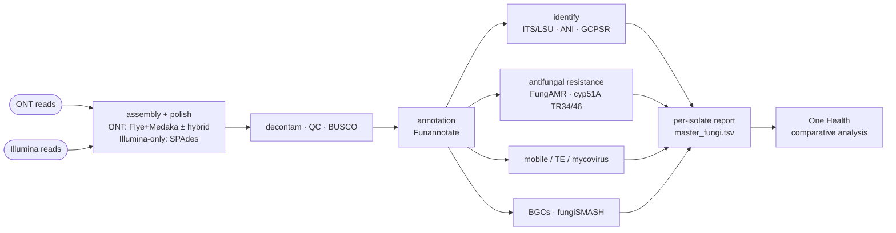

<!-- banner -->


<p align="center">
  
  
  
  
  
</p>

<p align="center"><b>Reproducible fungal genomics from Oxford Nanopore, Illumina, or ONT+Illumina hybrid — organism-agnostic: change inputs and config, never code.</b></p>

---


Reproducible **fungal genomics from Oxford Nanopore, Illumina, or a hybrid of both**: assembly → eukaryotic annotation → ITS/genome identification → **antifungal-resistance** calling → mobile/TE/mycovirus → **biosynthetic gene clusters** → novelty → One Health comparative analysis. Each isolate is routed automatically by its reads — long-read assembly (Flye + Medaka, ± Illumina polish) when ONT is present, or short-read assembly (SPAdes) from Illumina alone.

The fungal sibling of the *forge* family (captureforge / callforge / methylforge). Organism-agnostic by design: **change inputs and config, never code.**

## Pipeline



## Two layers

1. **Layer 1 — `fungiforge` (Nextflow DSL2)** — per-isolate genomics, 15 stages (`modules/stage00..14`):
   basecall QC → read QC → assembly (long-read **Flye** or short-read **SPAdes**) → polish (Medaka + optional Illumina hybrid; skipped for Illumina-only) → decontam/organelle → assembly QC/BUSCO → repeat-mask → Funannotate → identify → **antifungal resistance** → mobile/TE/mycovirus → **fungiSMASH BGCs** → novelty → eukaryote extras → per-isolate report + `master_fungi.tsv`.
2. **Layer 2 — `analysis/`** — objective scripts (mirroring the bacterial `r-analysis/`) that consume the master table and produce the compartment (air/human/surface) comparative story + figures + manuscript.

## Quickstart

```bash
# 1. one-time: fetch reference databases to local storage (hours)
export FUNGIFORGE_DB="/path/to/fungiforge_db"
bash bin/fetch_references.sh                 # aria2c: multi-connection, resumable

# 2. build a samplesheet. Per sample provide ONT, Illumina, or both — the CLI pairs
#    whatever it finds by sample id (ONT-only, Illumina-only, and hybrid can be mixed).
pip install -e .
fungiforge samplesheet --ont 'reads/*.ont.fastq.gz' \
    --illumina-r1 'reads/*_R1*.fastq.gz' --illumina-r2 'reads/*_R2*.fastq.gz' \
    --compartment SOIL --facility SITE_A --season WET -o samples.csv
# Illumina-only cohort? Just omit --ont:
#   fungiforge samplesheet --illumina-r1 'reads/*_R1*.fastq.gz' --illumina-r2 'reads/*_R2*.fastq.gz' -o samples.csv

# 3. run
nextflow run main.nf -profile local,docker \
    --samplesheet samples.csv --data_dir "$FUNGIFORGE_DB"
```

Each row needs **either** `ont_fastq` **or** paired `illumina_r1`+`illumina_r2` (or all three for hybrid); the pipeline routes each isolate automatically (`meta.assembly_mode`).

**Before a real run**, triage fresh **ONT** data with `bin/preflight_qc.sh` — per-sample read QC, an amplicon-vs-WGS check, a GO/MARGINAL/NO-GO assembly verdict, and an assembly-free species ID (even when coverage is too low to assemble). See [`docs/preflight_qc.md`](docs/preflight_qc.md). *(Illumina-only isolates don't use this ONT triage — QC runs in Stage 01 via fastp.)*

On an HPC cluster: `-profile hpc_slurm,singularity` (native, no emulation).

## Profiles

Compose one from each group:
- **execution:** `local` | `hpc_slurm`
- **packaging:** `conda` | `mamba` | `docker` | `singularity` | `apptainer`
- **test:** `test` — subsampled fixture; validate the DAG with `-profile test -stub-run`.

## Notes & best practices baked in

- **Input-mode–aware resistance confidence:** ONT homopolymer indels create false frameshifts exactly where antifungal-resistance point-mutations live, so **ONT-only** calls are flagged **provisional until hybrid-polished** (Medaka is applied; Polypolish adds Illumina when present). **Hybrid** and **Illumina-only** assemblies carry **high-confidence** calls — short-read base accuracy has no homopolymer-indel problem.
- **Antifungal resistance** uses a curated **FungAMR/MARDy** allele+mutation panel plus a dedicated *A. fumigatus* **cyp51A TR34/TR46** promoter-repeat detector (structural, not SNP).
- **Identification** uses ITS/LSU (UNITE) + genome ANI (sourmash/skani) with multi-locus **GCPSR** concordance — there is no GTDB for fungi.
- **Storage:** databases (~150–250 GB) and Nextflow `work/` live on an external drive via `--data_dir` / `-w`.

## Status

Scaffold validated end-to-end (`-profile test -stub-run`, all 15 stages) across all three input modes — ONT-only, Illumina-only, and hybrid. Stage implementations, the comparative analysis layer, HPC packaging, and a real-SRA test are in progress — see `docs/`.
