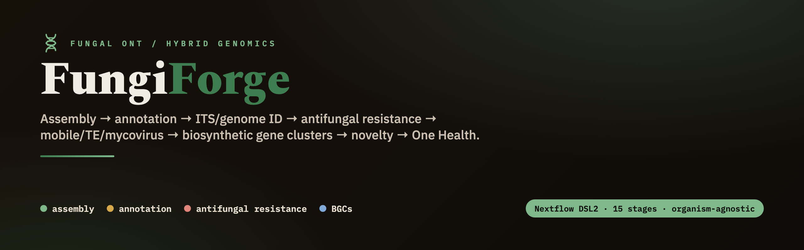

<!-- banner -->


<p align="center">
  
  
  
  
  
</p>

<p align="center"><b>Reproducible fungal genomics from Oxford Nanopore, Illumina, or ONT+Illumina hybrid — organism-agnostic: change inputs and config, never code.</b></p>

---


Reproducible **fungal genomics from Oxford Nanopore, Illumina, or a hybrid of both**: assembly → eukaryotic annotation → ITS/genome identification → **antifungal-resistance** calling → mobile/TE/mycovirus → **biosynthetic gene clusters** → novelty → One Health comparative analysis. Each isolate is routed automatically by its reads — long-read assembly (Flye + Medaka, ± Illumina polish) when ONT is present, or short-read assembly (SPAdes) from Illumina alone.

The fungal sibling of the *forge* family (captureforge / callforge / methylforge). Organism-agnostic by design: **change inputs and config, never code.**

## Pipeline


## Two layers

1. **Layer 1 — `fungiforge` (Nextflow DSL2)** — per-isolate genomics, 15 stages (`modules/stage00..14`):
   basecall QC → read QC → assembly (long-read **Flye** or short-read **SPAdes**) → polish (Medaka + optional Illumina hybrid; skipped for Illumina-only) → decontam/organelle → assembly QC/BUSCO → repeat-mask → Funannotate → identify → **antifungal resistance** → mobile/TE/mycovirus → **fungiSMASH BGCs** → novelty → eukaryote extras → per-isolate report + `master_fungi.tsv`.
2. **Layer 2 — `analysis/`** — objective scripts (mirroring the bacterial `r-analysis/`) that consume the master table and produce the compartment (air/human/surface) comparative story + figures + manuscript.

## Requirements

- **Nextflow** ≥ 23.10 and **Java** 17+ (`curl -s https://get.nextflow.io | bash`).
- **A container engine** — Docker, Singularity, or Apptainer (recommended) — **or** Conda/Mamba if you prefer per-stage envs (`env/*.yml`).
- **~150–250 GB** for the reference databases + working space (external drive is fine; point `--data_dir` / `-w` at it).
- The Python CLI (`fungiforge …`) is stdlib-only; `pip install -e .` just puts it on your PATH — the heavy tools all live in the containers/envs.

## Quickstart

```bash
# 1. one-time: fetch reference databases to local storage (hours)
export FUNGIFORGE_DB="/path/to/fungiforge_db"
bash bin/fetch_references.sh                 # aria2c: multi-connection, resumable

# 2. build a samplesheet. Per sample provide ONT, Illumina, or both — the CLI pairs
#    whatever it finds by sample id (ONT-only, Illumina-only, and hybrid can be mixed).
pip install -e .
fungiforge samplesheet --ont 'reads/*.ont.fastq.gz' \
    --illumina-r1 'reads/*_R1*.fastq.gz' --illumina-r2 'reads/*_R2*.fastq.gz' \
    --compartment SOIL --facility SITE_A --season WET -o samples.csv
# Illumina-only cohort? Just omit --ont:
#   fungiforge samplesheet --illumina-r1 'reads/*_R1*.fastq.gz' --illumina-r2 'reads/*_R2*.fastq.gz' -o samples.csv

# 3. run
nextflow run main.nf -profile local,docker \
    --samplesheet samples.csv --data_dir "$FUNGIFORGE_DB"
```

Each row needs **either** `ont_fastq` **or** paired `illumina_r1`+`illumina_r2` (or all three for hybrid); the pipeline routes each isolate automatically (`meta.assembly_mode`).

**Before a real run**, triage fresh **ONT** data with `bin/preflight_qc.sh` — per-sample read QC, an amplicon-vs-WGS check, a GO/MARGINAL/NO-GO assembly verdict, and an assembly-free species ID (even when coverage is too low to assemble). See [`docs/preflight_qc.md`](docs/preflight_qc.md). *(Illumina-only isolates don't use this ONT triage — QC runs in Stage 01 via fastp.)*

On an HPC cluster: `-profile hpc_slurm,singularity` (native, no emulation).

## Usage — the three input modes

Each isolate is routed automatically by the reads it has (`meta.assembly_mode`). All three modes can coexist in one samplesheet and one run.

```bash
# ONT-only  → Flye + Medaka (resistance flagged provisional)
nextflow run main.nf -profile local,docker --samplesheet samples.csv --data_dir "$FUNGIFORGE_DB"

# Hybrid (ONT + Illumina)  → Flye + Medaka + Polypolish (high-confidence resistance)
#   just include illumina_r1/illumina_r2 columns for those rows; --hybrid auto (default) uses them

# Illumina-only  → SPAdes short-read assembly (high-confidence resistance)
#   leave ont_fastq blank for those rows; choose the short-read assembler if you like:
nextflow run main.nf -profile local,docker --samplesheet samples.csv \
    --data_dir "$FUNGIFORGE_DB" --sr_assembler spades      # or: megahit
```

**Via the CLI wrapper** (adds sane defaults; extra `--`/`-` args pass straight through to Nextflow):

```bash
fungiforge run --samplesheet samples.csv --data_dir "$FUNGIFORGE_DB" \
    -profile local,docker --outdir results --resume -- --sr_assembler megahit --skip_bgc
```

Useful run-time flags: `-resume` (reuse cached stages), `-profile hpc_slurm,singularity` (HPC), `--outdir DIR`, and any option from the table below. Full help: `nextflow run main.nf --help`.

## Samplesheet

A CSV with a fixed header (parsed in `main.nf`). Per row provide **either** `ont_fastq` **or** paired `illumina_r1`+`illumina_r2` (or all three for hybrid); blank cells are fine.

```text
sample,ont_fastq,illumina_r1,illumina_r2,compartment,facility,season
AF_AIR_001,reads/AF_AIR_001.ont.fastq.gz,reads/AF_AIR_001_R1.fastq.gz,reads/AF_AIR_001_R2.fastq.gz,AIR,Abattoir_1,Dry   # hybrid
CA_HUM_014,reads/CA_HUM_014.ont.fastq.gz,,,HUMAN,Clinic_2,Wet                                                          # ONT-only
CA_SUR_009,,reads/CA_SUR_009_R1.fastq.gz,reads/CA_SUR_009_R2.fastq.gz,SURFACE,Clinic_2,Wet                             # Illumina-only
```

| Column | Required? | Meaning |
|---|---|---|
| `sample` | yes | unique isolate id (becomes the output dir and every filename) |
| `ont_fastq` | if no Illumina | ONT FASTQ (or a **pod5 dir** when `--basecall`) |
| `illumina_r1`, `illumina_r2` | if no ONT | paired short reads (both, or neither) |
| `compartment`, `facility`, `season` | no (`NA`) | One Health metadata, carried untouched to the master table |

`fungiforge samplesheet` builds this for you by pairing globs by sample id — omit `--ont` entirely for an Illumina-only cohort.

## Command-line reference

**Pipeline parameters** (`--flag value`; see `nextflow.config` for the full list):

| Parameter | Default | Meaning |
|---|---|---|
| `--samplesheet` | — | **required** — the input CSV |
| `--data_dir` | — | reference-database root (`bin/fetch_references.sh`) |
| `--outdir` | `results` | output directory |
| `--hybrid` | `auto` | ONT isolates: `auto` (polish with Illumina if present) \| `on` \| `off` |
| `--assembler` | `flye` | long-read assembler: `flye` \| `canu` \| `raven` |
| `--sr_assembler` | `spades` | short-read (Illumina-only) assembler: `spades` \| `megahit` |
| `--purge_dups` | `true` | collapse heterozygous haplotigs (long-read only) |
| `--busco_lineage` | `auto` | `auto` (order-specific after ID) \| e.g. `fungi_odb10` |
| `--basecall` | `false` | run Dorado on a pod5 dir (`ont_fastq` = pod5 dir); needs `--dorado_model` |
| `--ont_min_qual` / `--ont_min_len` | `10` / `1000` | chopper Q / length filters (Stage 01) |
| `--run_interproscan` | `false` | heavy under emulation; on for HPC |
| `--skip_decontam` / `--skip_mge` / `--skip_bgc` / `--skip_novelty` / `--skip_extras` | `false` | skip optional stages |
| `--max_cpus` / `--max_memory` / `--max_time` | `16` / `120.GB` / `96.h` | resource caps |

**CLI subcommands** (`fungiforge <cmd>`):

| Command | What it does |
|---|---|
| `run` | wrap `nextflow run main.nf` (`--samplesheet --data_dir --outdir -profile -resume`; extra args pass through) |
| `samplesheet` | build a samplesheet from ONT and/or Illumina globs (`--ont --illumina-r1 --illumina-r2 --compartment --facility --season -o`) |
| `fetch-refs` | print the reference-DB fetch command (`--data_dir`) |
| `version` | print the version |

## Outputs

Results are written under `--outdir` (default `results/`), one directory per isolate plus a cohort summary:

```text
results/
├── <sample>/
│   ├── 00_basecall/     # only with --basecall
│   ├── 01_readqc/       # *.ont.filt.fastq.gz, readqc.json, NanoPlot/fastp reports
│   ├── 02_assembly/     # <sample>.assembly.fasta
│   ├── 03_polish/       # <sample>.medaka.fasta, <sample>.polished.fasta, polish.json (mode + confidence)
│   ├── 04_decontam/     # <sample>.nuclear.fasta, <sample>.mito.fasta, decontam.json
│   ├── 05_assembly_qc/  # assemblyqc.json (QUAST contiguity, BUSCO/compleasm, qc_pass)
│   ├── 06_repeatmask/   # <sample>.masked.fasta, <sample>.telib.fasta, repeat.json
│   ├── 07_annotate/     # <sample>.proteins.faa, <sample>.gbk, annotate.json
│   ├── 08_identify/     # <sample>.species.txt, <sample>.markers.fasta, identify.json
│   ├── 09_resistance/   # resistance.json (calls + confidence + cyp51A TR)
│   ├── 10_mobile/  11_bgc/  12_novelty/  13_extras/   # *.json
│   └── 14_report/       # <sample>.report.html  ← self-contained per-isolate report
├── 04_summary/          # master_fungi.tsv  ← one row per isolate (the Layer-2 handoff)
└── pipeline_info/       # execution_report.html, timeline.html, trace.txt
```

Every stage emits a small `*.json` with a stable schema; Stage 14 merges them into the HTML report and appends the isolate's row to `04_summary/master_fungi.tsv`, which Layer 2 (`analysis/`) consumes.

## Profiles

Compose one from each group:
- **execution:** `local` | `hpc_slurm`
- **packaging:** `conda` | `mamba` | `docker` | `singularity` | `apptainer`
- **test:** `test` — subsampled fixture; validate the DAG with `-profile test -stub-run`.

## Notes & best practices baked in

- **Input-mode–aware resistance confidence:** ONT homopolymer indels create false frameshifts exactly where antifungal-resistance point-mutations live, so **ONT-only** calls are flagged **provisional until hybrid-polished** (Medaka is applied; Polypolish adds Illumina when present). **Hybrid** and **Illumina-only** assemblies carry **high-confidence** calls — short-read base accuracy has no homopolymer-indel problem.
- **Antifungal resistance** uses a curated **FungAMR/MARDy** allele+mutation panel plus a dedicated *A. fumigatus* **cyp51A TR34/TR46** promoter-repeat detector (structural, not SNP).
- **Identification** uses ITS/LSU (UNITE) + genome ANI (sourmash/skani) with multi-locus **GCPSR** concordance — there is no GTDB for fungi.
- **Storage:** databases (~150–250 GB) and Nextflow `work/` live on an external drive via `--data_dir` / `-w`.

## Documentation

- **[User manual](docs/manual/fungiforge_manual.md)** ([PDF](docs/manual/fungiforge_manual.pdf)) — full stage-by-stage reference, parameters, outputs, troubleshooting.
- **[Design decisions](docs/decisions.md)** · **[Reused vs bespoke](docs/reuse.md)** — the engineering rationale per stage.
- **[Preflight QC](docs/preflight_qc.md)** — fast ONT triage before a long run.
- **[HPC deployment](docs/hpc_deployment.md)** — running on a Slurm cluster.

## Status

Scaffold validated end-to-end (`-profile test -stub-run`, all 15 stages) across all three input modes — ONT-only, Illumina-only, and hybrid. Stage implementations, the comparative analysis layer, HPC packaging, and a real-SRA test are in progress — see `docs/`.
